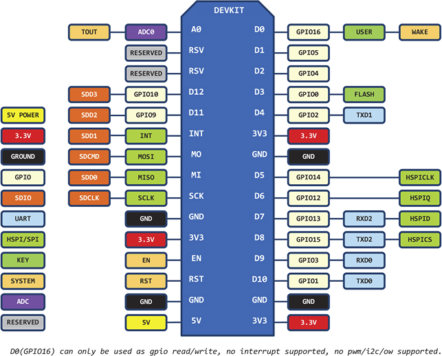
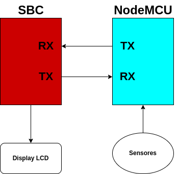

# IOInterface

<details>
<summary>Texto do Problema</summary>

---

## Tema

Projeto de sensor analógico/digital em microcontrolador utilizando comunicação serial.

## Objetivos de Aprendizagem

Ao final da realização deste problema, o/a discente deverá ser capaz de:

- Entender como integrar código assembly e códigos C para produzir um programa executável;
- Compreender e executar a programação de dispositivos microcontroladores;
- Assimilar conceitos básicos sobre protocolos de comunicação serial.

## Problema
Dando prosseguimento ao desenvolvimento do protótipo de um sistema digital baseado em um processador ARM, o próximo passo compreende a implementação de um protótipo de sistema de sensoriamento genérico. Na fase de protótipo do projeto será utilizada uma plataforma baseada na NodeMCU para confecção das unidades de sensoriamento. Elas são muito flexíveis e versáteis, sendo ideais para a criação de um ecossistema de Internet das Coisas (IoT). Para simplificar a prova de  conceito será utilizado um sensor analógico e dois sensores digitais, mas o sistema deve ser modular, permitindo a substituição na versão de produção.

O sistema será comandado por um Single Board Computer (SBC), e deve ser capaz de controlar o acionamento de um conjunto variável de sensores, assim como monitorar o seu funcionamento, de forma automatizada. Cada operação de leitura ou monitoramento deve ser representada por um código. Dessa forma, o sistema embarcado na NodeMCU deve ser capaz de interpretá-los e realizá-los de maneira adequada, por meio de uma comunicação UART.

---

</details>

## Autores
<div align="justify">
    <li><a href="https://github.com/ozenilsoncruz">@Ozenilson Cruz</a></li>  <li><a href="https://github.com/traozin">@Antônio Neto</a></li>
</div>

### Instruções

Esse projeto necessita que o usuário tenha a IDE do Arduino instalada em sua máquina, necessária para comunicação com a NodeMCU. Para isso, siga as instruções do link abaixo:

1. Siga os passos para fazer a [Instalação do Arduino IDE](https://www.arduino.cc/en/Guide/Windows#toc4).
2. Siga os passos para fazer a [Instalação do Driver da NodeMCU](https://www.blogdarobotica.com/2020/05/26/instalando-driver-serial-para-nodemcu-com-chip-ch340/).
3. Baixe o arquivo main_esp.ino e faça upload para o NodeMCU.
4. Em uma Raspiberry Pi Zero W, clone o repositório.
   ```sh
   git clone https://github.com/traozin/IOInterface
   ```
5. Dentro da pasta do repositório execute os passos abaixo: 
    1. Makefile:
		  - Para compilar o código que utiliza threads:
              ```sh
              make main=main_threads outhres=-lpthreads
              ```
          - Para compilar o código sem threads:
              ```sh
              make main=main
              ```
    2. Execute com: 
          ```sh
          sudo ./main
          ```

## Biblioteca Assembly em C [^sLib]

As funções definidas em assembly que serão chamadas de C devem ser prototipadas como “C” externo em C.

O Exemplo 1 abaixo ilustra uma função C chamada main(), que chama uma função de linguagem assembly chamada asmfunc, que é mostrada no Exemplo 2. A função asmfunc pega seu único argumento, adiciona-o à variável global C chamada gvar e retorna o resultado.


Exemplo 1: Chamando uma função de linguagem assembly de um programa C.

```c
extern "C" {
extern int asmfunc(int a); /* declare external asm function */
int gvar = 0; /* define global variable */
}

void main()
{
    int I = 5;

    I = asmfunc(I); /* call function normally */
}
```
Exemplo 2: Programa em linguagem assembly chamado pelo exemplo 1

```s
         .global asmfunc
         .global gvar
asmfunc:
         LDR r1, gvar_a
         LDR r2, [r1, #0]
         ADD r0, r0, r2
         STR r0, [r1, #0]
         MOV pc, lr
gvar_a .field gvar, 32
```

No programa C do Exemplo 1, a declaração externa “C” diz ao compilador para usar convenções de nomenclatura C (ou seja, sem desmembramento de nomes). Quando o vinculador resolve a referência .global _asmfunc, a definição correspondente no arquivo de montagem corresponderá.

O parâmetro i é passado em R0 e o resultado é retornado em R0. R1 contém o endereço do gvar global. R2 mantém o valor de gvar antes de adicionar o valor i a ele.

## Node MCU [^nodemcu]

<p align="center"></p>
<p align="center">Diagrama de Mapeamento de Pinos do ESP8266</p>

- Módulo NodeMcu Lua ESP-12E
- Versão do módulo: V2
- Memória flash: 4 MB
- Tensão de operação:
- Pinos Digitais: 3,3 V
- Pino Analógico: 1,0 V
- Wireless padrão 802.11 b/g/n
- Antena embutida
- Conector micro-usb para programação e alimentação
- Modos de operação: STA/AP/STA+AP
- Suporta 5 conexões TCP/IP
- Portas GPIO: 13
- D0 (GPIO16) só pode ser usado como entrada ou saída, não suporta outras funções (interrupção, PWM, I2C, etc)
- GPIO com funções de PWM, I2C, SPI, etc
- Resolução do PWM: 10 bits (valores de 0 a 1023)
- 01x Conversor analógico digital (ADC)
- Distância entre pinos: 2,54 mm
- Dimensões: 49 x 26 x 7 mm (sem considerar os pinos)

## Sensores Digitais vs Analógicos [^sensores]

O termo "sensor" em si significa um mecanismo projetado para medir um parâmetro, a fim de processar ainda mais o resultado da medição. O circuito do sensor gera um sinal de forma conveniente para a transmissão e, em seguida, o sinal é convertido, processado ou armazenado.

##### Analógico

Um sensor analógico gera um sinal analógico na saída, cujo valor de nível é obtido em função do tempo, e esse sinal muda continuamente, o sinal constantemente recebe qualquer um dos muitos valores possíveis.

Portanto, sensores analógicos são adequados para rastrear continuamente a grandeza física, por exemplo tensão terminal do termopar sinaliza uma mudança de temperatura e a tensão no enrolamento secundário do transformador de corrente é em um determinado período proporcional à corrente do circuito controlado. O microfone é um sensor de mudanças de pressão de uma onda sonora, etc.

##### Digital

Os sensores digitais, por sua vez, geram um sinal de saída que pode ser gravado na forma de uma sequência de valores numéricos, geralmente o sinal é binário, ou seja, um nível alto ou baixo (zero). Quando um sinal de sensor digital precisa ser transmitido por um canal analógico, como o rádio, recorra ao uso da modulação.

Os sensores digitais dominam os sistemas de comunicação porque seus sinais de saída são facilmente regenerados no repetidor, mesmo se houver ruído. E o sinal analógico, nesse sentido, será distorcido pelo ruído e os dados serão imprecisos. Ao transmitir informações, os sensores digitais são mais aceitáveis. Eles são adequados para detectar a presença ou ausência de um objeto, por exemplo.

## UART [^rohde-uart] [^freebsd-uart]

O UART(Transmissor/receptor assíncrono universal) é um protocolo de transmissão de dados muito simples, onde só é necessário apenas dois fios para a comunicação entre suas extremidades em ambas as direções. Além disso, o UART é um dos padrões seriais mais antigos do mundo, onde acabou sendo amplamente utilizado em dispositivos que faziam uso de portas seriais.

Existem dois tipos de comunicação Serial, a Síncrona e a Assíncrona. 

A comunicação Síncrona requer que o emissor e o receptor dos dados tenham um clock em comum, ou no mínimo, o emissor forneça um sinal de tempo para que o receptor saiba quando se deve "ler" o próximo bit dos dados. Na maioria das formas de comunicação serial síncrona, se não houver dados disponíveis em um dado instante para transmitir, um caractere de preenchimento deve ser enviado para que os dados sejam sempre transmitidos.

Já a transmissão assíncrona permite que os dados sejam transmitidos sem que o emissor tenha que enviar um sinal de relógio ao receptor. Em vez disso, o remetente e o receptor devem concordar com os parâmetros de tempo de antecedência e bits especiais são adicionados a cada palavra, os quais são usados para sincronizar as unidades de envio e recebimento.

Como o próprio nome já diz, o UART é um protocolo de comunicação assíncrona, sendo assim, ambas as extremidades devem transmitir ao mesmo tempo e em velocidade predefinida para poder ter a mesma temporização de bits. As taxas de baud mais comuns utilizadas em UART atualmente são 4800, 9600, 19,2 K, 57,6 K e 115,2 K. Além de ter a mesma taxa de bauds, ambos os lados de uma conexão UART também têm que usar a mesma estrutura de frames e parâmetros.

<p align="center"></p>
<p align="center">Frame UART</p>

Frames UART contém bits iniciais e finais, bits de dados e um bit opcional de paridade.

Na conexão da UART temos dois dispositivos, o pino transmitter, também chamado de TX, responsável pela transmissão do dado, e o pino receiver, também chamado de RX, responsável por receber um dado transmitido. Ambos os pinos devem estar conectados entre si para que a comunicação ocorra. O diagrama de blocos abaixo esquematiza as conexões entre a SBC e o NodeMCU. 

<p align="center"></p>
<p align="center">Comunicação UART SBC/NodeMCU </p>

A comunicação é iniciada pela SBC que realiza requisições que devem ser interpretadas pelo NodeMCU. As requisições são sempre de dois bytes, o primeiro byte representa o comando a ser solicitado e o segundo o endereço do sensor. Dessa forma, em comandos que não necessitam necessariamente de um endereço do sensor, o segundo byte é '0'. Os comandos de requisições estão na tabela abaixo.

<table class="tg" align= "center">
<thead>
  <tr>
    <th class="tg-amwm">Código</th>
    <th class="tg-amwm">Descrição do comando<br></th>
  </tr>
</thead>
<tbody>
  <tr>
    <td class="tg-baqh">'3'</td>
    <td class="tg-baqh">Solicita a situação atual do NodeMCU</td>
  </tr>
  <tr>
    <td class="tg-baqh">'4'</td>
    <td class="tg-baqh">Solicita o valor da entrada analógica</td>
  </tr>
  <tr>
    <td class="tg-baqh">'5'</td>
    <td class="tg-baqh">Solicita o valor de uma das entradas digitais</td>
  </tr>
  <tr>
    <td class="tg-baqh">'6'</td>
    <td class="tg-baqh">Acendimento do led da NodeMCU</td>
  </tr>
</tbody>
</table>
<p align="center">Comandos de requisição</p>

Em caso da NodeMCU receber uma mensagem que não pôde ser codificada, uma mensagem de resposta contendo '1F' é retornada sinalizando que a NodeMCU está com problema.

##### Bits iniciais e finais

Devido ao UART ser assíncrono, o transmissor precisa sinalizar que os bits de dados estão chegando. Isso é possível ao utilizar o bit inicial. O bit inicial é uma transição do estado inativo para um estado baixo, imediatamente seguido pelos bits de dados do usuário.

Depois que os bits de dados tiverem terminado, o bit final indica o fim dos dados do usuário. O bit de parada é uma transição de volta para o estado alto ou inativo, ou a permanência no estado alto for um tempo de bit adicional.

##### Bit de paridade
 Um segundo bit final (opcional) pode ser configurado, geralmente para dar ao receptor tempo para se preparar para o próximo frame, mas essa é uma prática relativamente incomum.

##### Bits de dados

Os bits de dados são dados de usuário ou bits "úteis" e vêm imediatamente depois do bit inicial. Pode haver de 5 a 9 bits de dados de usuários, apesar de ser mais comum haver 7 ou 8 bits. Esses bits de dados geralmente são transmitidos com o bit menos significativo primeiro.

### Comunicação UART na SBC
--------------------------------------------------------------------------
A SBC é uma Raspberry Pi Zero W e para sua implementação as bibliotecas `unistd.h`, `fcntl.h` e `termios.h` foram utilizadas seguindo os seguintes passos:
- Mapeamento da memória da uart: utiliza a função open(“/dev/serial0”, tipos de abertura). Os tipos de abertura foram O_RDWR, O_NOCTTY, O_NDELAY, que abre no modo de leitura/gravação sem bloqueio; 
- Configuração das flags: cria uma estrutura que define o comportamento da comunicação, como valor de baud-rate em 9600 e se tem ou não paridade;

O código de configuração da comunicação UART pode ser observado abaixo. 
```c
/**
 * Realiza as configuracoes iniciais da UART
 */
int uart_config(){
    //Abertura do arquivo da UART
	int uart_filestream = -1;
	uart_filestream = open("/dev/serial0", O_RDWR | O_NOCTTY | O_NDELAY); // Abre em modo escrita/leitura bloqueado
	if (uart_filestream == -1){
		printf("\nFalha na abertura do arquivo!\n");
        return uart_filestream;
	}

    struct termios options;
    tcgetattr(uart_filestream, &options);
    options.c_cflag = B9600 | CS8 | CLOCAL | CREAD;
    options.c_iflag = IGNPAR;
    options.c_oflag = 0;
    options.c_lflag = 0;
    tcflush(uart_filestream, TCIFLUSH);
    tcsetattr(uart_filestream, TCSANOW, &options);

    return uart_filestream;
}
```

Após a configuração inicial da Raspberry, os métodos de envio e recebimento de mensagens podem ser chamados para realizar a comunicação. No código abaixo encontra-se a implementação da função de envio de mensagem ,*uart_send()*, que envia um conjunto de caracteres via UART utilizando a função *write()* presente na biblioteca `unistd.h`.
```c
/**
 * Envia uma mensagem via UART
 * @param msg - texto a ser enviado
 * @param uart_filestream - arquivo uart
*/
void uart_send(char* msg, int uart_filestream){
	if(write(uart_filestream, msg, strlen(msg)) == -1){
		printf("\nFalha ao enviar mensagem!\n");
	}
}
```

A função responsável por receber as mensagens é a *uart_receive()*, que utiliza a função *read()*, também presente em `unistd.h`, para ler uma determinada quantidade de bytes. Devido a alguns erros ocorrerem em mensagens superiores a 2 bytes, como a não chegada da mensagem completa ou mesmo de dados não decifráveis, antes de fazer uma leitura a função aguardava um tempo de 2 segundos (alguns testes mostraram que 1 segundo era suficiente para receber até 4 bytes, mas, para evitar eventuais falhas fora adicionado um tempo maior).

```c
/**
 * Envia uma mensagem via UART
 * @param uart_filestream - arquivo uart
*/
char* uart_receive(int uart_filestream){
	static char mensagem[] = ""; //define o tamanho da mensagem
	int msg_length = -1;
	sleep(2);

	while(msg_length <= 0){ // se a mensagem for menor ou igual a zero
		msg_length = read(uart_filestream, (void*)mensagem, 5); // ate 5 bytes
		if(msg_length > 0){
			mensagem[msg_length] = '\0';
			if(strcmp(mensagem, "1F") == 0){
				char texto[] = "Erro na NodeMCU!";
				write_textLCD(texto);
			}
		}
	}
	return mensagem;
}
```

Essa abordagem não é eficiente pois nada garante que a mensagem chegue no período de 2 segundos. Dessa forma, a função *uart_receive()* foi atualizada para permitir escolher uma quantidade de bytes que deseja que a mensagem contenha realizando, se necessário, mais de uma leitura para uma mensagem.

```c
/**
 * Envia uma mensagem com o tamanho especificado
 * @param uart_filestream - arquivo uart
 * @param tamanho_mensagem - tamanho da mensagem a ser recebida
*/
char* uart_receive(int uart_filestream, int tamanho_mensagem){
	static char mensagem[] = ""; //define o tamanho da mensagem
	int tamanho = 0;
	int tamanho_mensagem_aux = tamanho_mensagem;

	while(tamanho < tamanho_mensagem){ // se a mensagem for menor ou igual a zero
		char aux[] = ""; //variavel auxiliar que armazena o tamanho da string
		msg_length = read(uart_filestream, (void*)aux, tamanho_mensagem_aux);
		
		if(msg_length > 0){
			aux[msg_length] = '\0';
			if(strcmp(aux, "1F") == 0){
				char texto[] = "Erro na NodeMCU!";
				mensagem = ""
				write_textLCD(texto);
			}else{
				tamanho = tamanho + msg_length;
				tamanho_mensagem_aux = tamanho_mensagem_aux - msg_length;
				sprintf(mensagem, "%s", aux); // concatena o resultado dentro do loop 
			}
		}
	}
	return mensagem;
}
```

Apesar da função resolver o problema de espera, como é necessario aguardar que pelo menos um byte seja recebido, a SBC pode acabar entrando em um estado de espera continua, sem poder realizar novas solicitações. Pensando nisso, outra abordagem utilizando threads para programação concorrente foi desenvolvida e pode ser visto em `main_threads.c`. Basicamente, realiza os recebimentos das mensagens sem a necessidade de realizar novas solicitações manuais constantemente. 
A função *receiveMsg()* será executada em uma thread e contem um loop que é executado a depender de alguns dados das variáveis globais _msgg_, informação a ser exibida no display, e _solicitacao_, solicitação para NodeMCU. Esses dados são recebidos e atualizados no display de LCD constantemente. A função foi utilizada apenas para as solicitações que precisam ser atualizadas a cada mudança de valor como as informações das entradas analógicas e digitais.

```c
/**
 * Recebe a mensagem e escreve no display continuamente
 * @param dados[2] - contem o arquivo uart em dados[0] e 
 * 					 a qtd de bytes a serem recebidos em dados[1]
*/
void * receiveMsg(void * dados){
    int d[] = *((int *) dados);

    char texto[] = "";
    while(strcmp(msgg, "") != 0 || strcmp(solicitacao, "") != 0){ // enquanto a mensagem de finalizacao n$
        uart_send(solicitacao,  d[0]);
        char* result = uart_receive(d[0], d[1]);
        if(strcmp(result, "") != 0){
            sprintf(texto, "%s%s", msgg, result); // concatena o conte$
            write_textLCD(texto);
        }
    }
}
```

### Comunicação UART na NodeMCU [^arduino]
--------------------------------------------------------------------------
Na NodeMCU a comunicação via UART foi construida utilizando a classe Serial
da linguagem do arduino que facilitou a implementação por abstrais algumas informações. Os métodos utilizados foram:
- *Serial.avaliable()*:  Verifica a quantidade de bytes disponíveis para leitura da porta serial. 
- *Serial.begin()*: Define a taxa de dados em bits por segundo (baud) para transmissão serial de dados (baud-rate). Assim como na SBC, o baud-rate foi definido como 9600 bps.
- *Serial.readString()*: Lê caracteres do buffer serial em uma String.
- *Serial.print()*: Imprime dados na porta serial como texto ASCII legível por humanos. Usado para enviar uma string para a SBC.

No código abaixo temos um exemplo da utilização de alguns desses métodos. O *available()* verifica se tem mensagem para ser lida, *readString()* lê a mensagems retornando uma String e *print()* envia uma String como resposta.
```cpp
if(Serial.available() > 0){ // Retorna o número de bytes (caracteres) 
                              // disponíveis para leitura da porta serial.
    String msg = Serial.readString(); // Le uma String
    
    if(msg[0] == '3'){
      Serial.print("00");
    }
...
}
```

## Testes

Para averiguar o funcionamento correto do projeto implementado os seguintes testes foram realizados:

- Solicitação do status da NodeMCU;
- Envio de uma mensagem não esperada pela NodeMCU;
- Acendimento e apagamento do LED múltiplas vezes;
- Solicitação de um sensor digital não pinado;
- Múltiplas solicitações de sensores digitais pinados e acionados no momento da solicitação;
- Solicitação do valor da entrada analógica no momento em que está com o menor valor possível;
- Solicitação do valor da entrada analógica no momento em que está com o menor valor possível;
- Solicitação do valor da entrada analógica múltiplas enquanto o pino é alterado;

Todos os testes funcionaram da forma planejada e retornaram os valores esperados. Entretanto, quando multiplas solicitações foram realizadas, o tempo de espera para os recebimento das mensagens foi muito longo pois a função de recebimento ainda contava com o delay.

## Conclusão
Por meio deste projeto, conceitos importantes de comunicação serial foram devidamente incorporados e compreendidos para a solução, bem como a utilidade da utilização de microcontroladores para diversos tipos de aplicações.

O código deste projeto é capaz de resolver o problema apresentado utilizando de bibliotes nativas das linguagens C e Arduino. Toda via, algumas das soluções podem não apresentar o melhor funcionamento possível e as atualizações que aprimoram o código anterior não foram devidamente testadas.

| :arrow_left: [Problema anterior](https://github.com/ozenilsoncruz/timer_assembly) |.................................. :arrow_up: [Voltar ao topo](#IOInterface) :arrow_up: ..................................| [Próximo problema](https://github.com/ozenilsoncruz/IoMQTT) :arrow_right: | 
| :----: |-----| :-----:|


[^rohde-uart]: Compreender UART - [rohde-schwarz.com](https://www.rohde-schwarz.com/br/produtos/teste-e-medicao/osciloscopios/educational-content/compreender-uart_254524.html)

[^freebsd-uart]: Tutorial sobre Comunicações Seriais e UART - [docs.freebsd.org](https://docs.freebsd.org/pt-br/articles/serial-uart/)

[^nodemcu]: NodeMCU ESP8266-12 V2 Especificações - [robocore.net](https://www.robocore.net/wifi/nodemcu-esp8266-12-v2)

[^sensores]: Qual é a diferença entre sensores analógicos e digitais - [i.electricianexp.com](https://i.electricianexp.com/pt/main/praktika/1185-analogovye-i-cifrovye-datchiki.html)

[^sLib]: Interfacing C and C++ With Assembly Language - [software-dl.ti.com](https://software-dl.ti.com/codegen/docs/tiarmclang/compiler_tools_user_guide/compiler_manual/runtime_environment/interfacing-c-and-c-with-assembly-language-stdz0544217.html)

[^arduino]: Serial - [arduino.cc](https://www.arduino.cc/reference/en/language/functions/communication/serial/)
